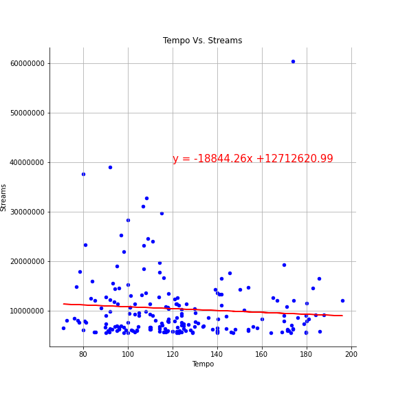
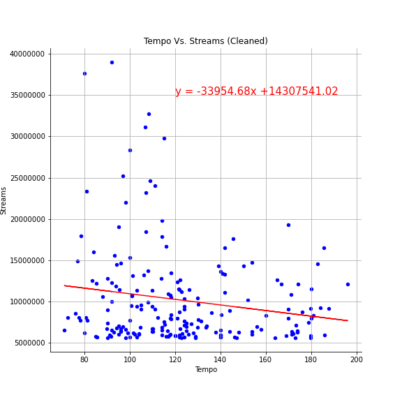
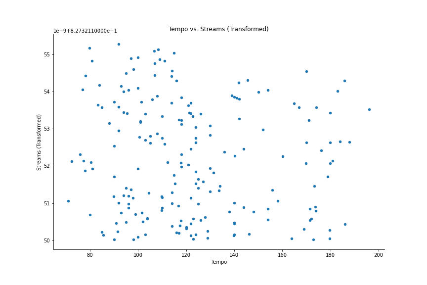
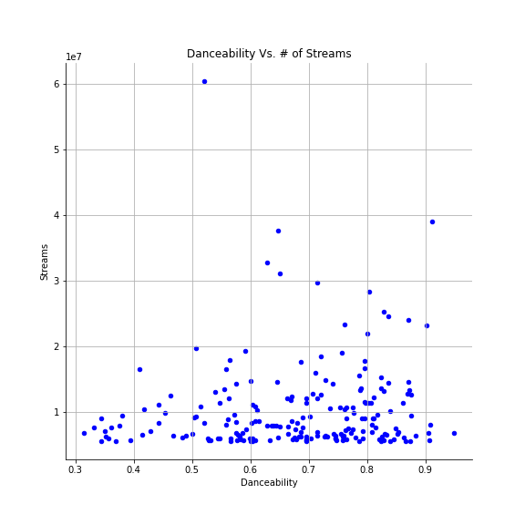
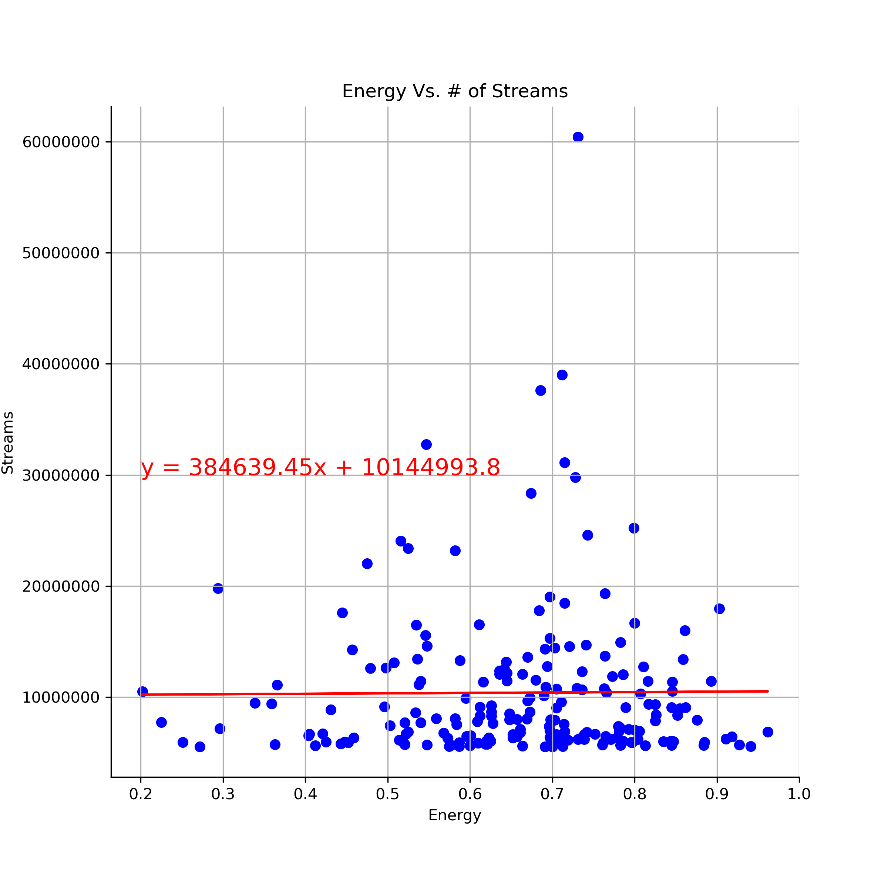
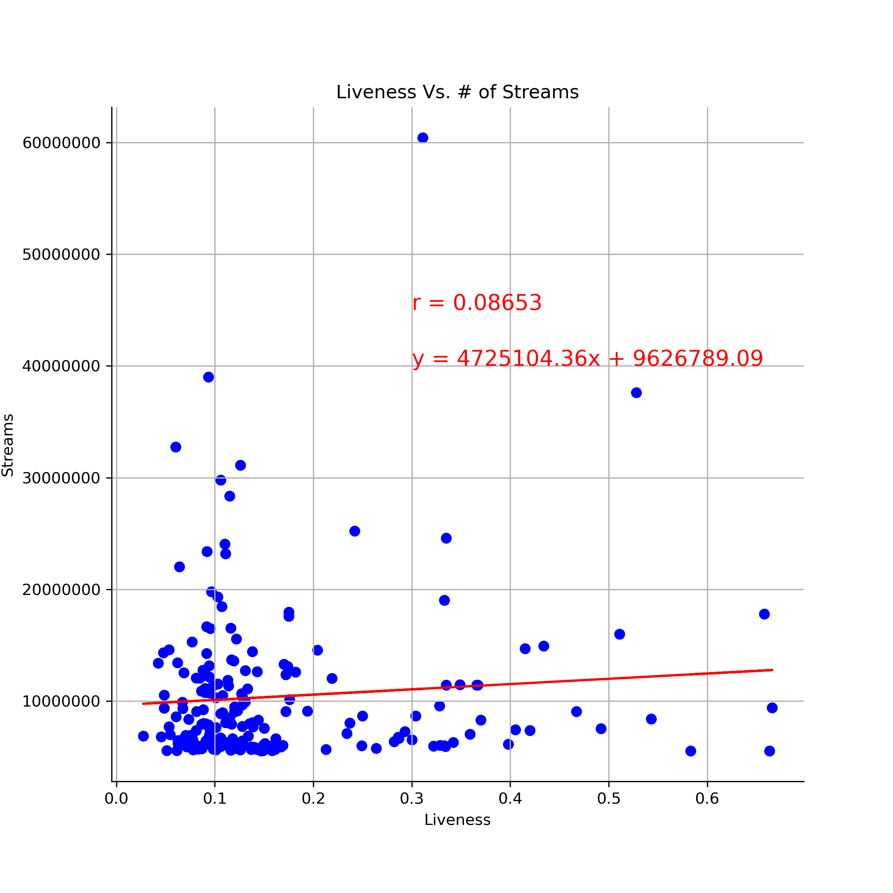
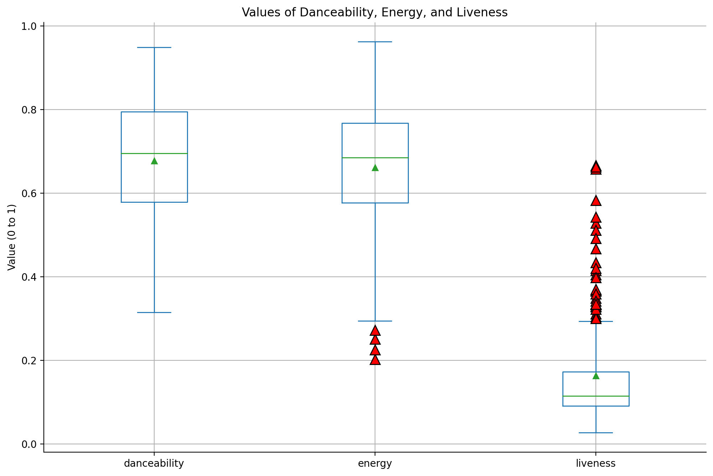
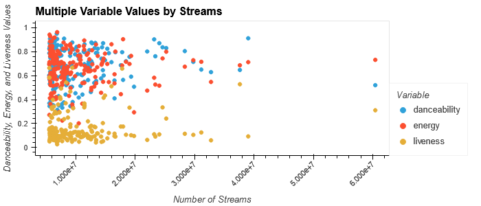
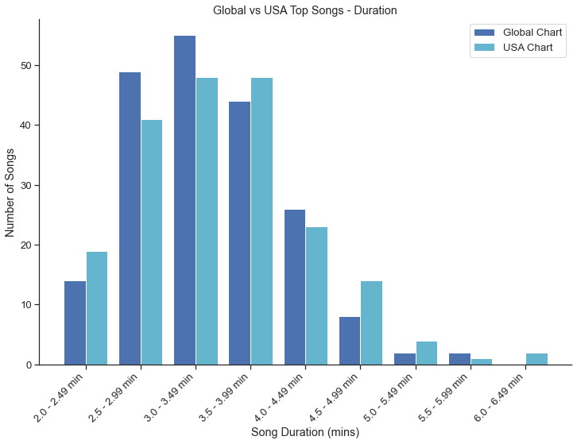
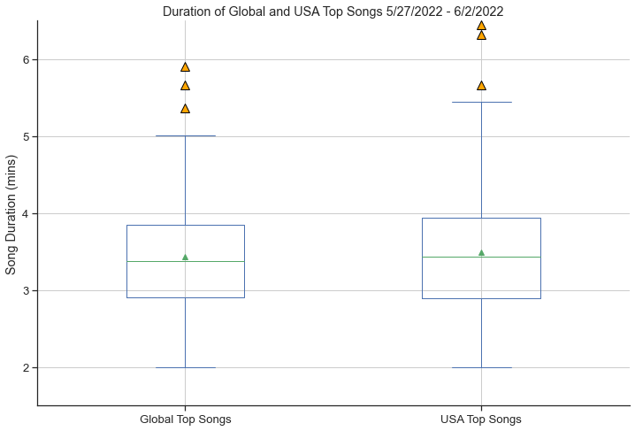

# Spotify Project Proposal & Findings
Group Project 1

## Project Title: 
The Spotify API Analysis 

## Team Members: 
Molly Bruns, Sydney Cohen, Maite Rivas, B Slone

## Project Description/Outline: 
Analyze various audio features of publicly available spotify top charts for the week of June 2nd 2022 to see how a given audio feature is represented in top songs 

## Research Questions to answer: 
* Does tempo significantly impact the danceability of global top songs?
* Is there any significant relationship between top global songs and their danceability, energy, and liveness?
* Does energy help us predict the valence of top songs? 
* Is there any significant relationship between a top song’s duration and its other audio audio features?

## Datasets to Be Used:
* Publicly available spotify top charts found at [charts.spotify.com](https://charts.spotify.com/charts/view/regional-global-weekly/latest)
* [Spotify API](https://developer.spotify.com/documentation/web-api/reference/#/operations/get-several-audio-features) data based on song ID for songs of interest 

## Rough Breakdown of Tasks: 
* Create dataframe of top songs of interest for given investigation
* Clean up raw csv from publicly available top charts 
* Loop through spotify API to pull variable of interest 
* Basic visualizations and statistical analysis to determine interesting correlations and trends based on question
* Choose and create useful visualizations and explain inferences 

## Findings

**Does tempo significantly impact the danceability of global top songs?**

At first glance, the [scatter plot](https://github.com/mbruns13/project_1_spotify/blob/main/images/Tempo_vs_Danceability.png) representing the relationship between tempo and danceability appears to have little to no correlation. This is likely true, as the linear regression shows a slope of 0, though a slight negative relationship. Based on the R squared value of this regression, only 4.5% of the variability observed in the danceability of a track is explained by the regression model. At best, this tells us that there is either an extremely weak or more likely nonexistent relationship between tempo and danceability, which was surprising given the fact that intuitively, the speed or pace of a song would have some impact on how easy it is to dance to.

When looking at the Pearson correlation method for the two variables, we get a value of -0.21, which indicates a very weakly negative relationship between the tempo and danceability. This could mean that as tempo increases, songs might get less danceable, but because of the weak correlation we cannot confidently conclude this.
If anything, the most interesting part of this investigation is the fact that there wasn’t an obvious correlation between tempo and danceability. It is likely that the other sound features used to calculate danceability have a larger effect on danceability than simply tempo alone. 

Once again, we were surprised by the little to nonexistent correlation between variables, this time between tempo and the amount of streams a song on the top charts has. 
 

As you can see, tempo varies widely in the top charts, but there is no significant trend appearing visually, beyond the fact that it seems songs between the range of 80-120 bpm may have a higher amount of streams than faster songs.  
However, after running a linear regression on the dataset, the pearson correlation indicated a value of -0.08, meaning there is likely a nonexistent correlation between tempo and streams. Similarly, the R squared for the regression model was 0.07%, so the regression doesn’t substantively represent the variability observed in the amount of streams of a track. 

In an effort to see if outlier data points were skewing the relationship, I removed the song “As it Was” by Harry Styles, which had the highest amount of streams by far and an incredibly fast tempo at 173 bpm. This increased the pearson correlation a bit, but is still negligible at -0.17, indicating a extremely weak negative correlation between tempo and streams. The R squared value remained weak as well, though also slightly better than before, at 2.9%. We can conclude that there is no significant relationship between tempo and streams. 

The tempo and streams scatter plot appeared visually to have a lognormal distribution, so I applied a box-cox power transform to make the data more Gaussian-like, or normal. 

Above is the histogram of streams vs frequency on the left, which looked like it could be some type of lognormal distribution. However, after plotting the transformed stream data against tempo, it is obvious on the scatter plot on the right that there is no correlation between the variables. Of course, the pearson correlation value from the last slide also indicated there was no correlation between the variables, but this visualization also shows us that even with a power transform, the data is not Gaussian-like, and the only conclusion we can draw is that there is no correlation between tempo and streams. 

*See code [here](song_data_sydney.ipynb)*

**Is there any significant relationship between top global songs and their danceability, energy, and liveness?**

When looking at the Spotify top 200 global song chart, I was curious to see if they had any relationship with their respective audio features: danceability, energy, and liveness. My goal was to determine whether or not songs with high values of danceability, energy, and liveness tended to be more popular (higher streams count) than those with lower values, or vice versa. In order to find the answers I needed, I created a [script](maite_danceability_energy.ipynb) to generate multiple statistical analyses and representations of the song features in questions using figures containing scatterplots, boxplots, and some bar charts. I attempted to plot the data in multiple ways and comparing different variables, however, even when comparing some to each other, all of them had very weak or little to no correlation.

To start off, I looked at each top song's specific feature (danceability, energy, liveness) and compared it to their respective number of streams during the week of May 27th through June 2nd. All of them showed positive r values, which could indicate a positive correlation between each song feature and the number of streams a song has. However, all the r values were close to 0, which indicates a very *weak* positive correlation between them and the number of streams. Therefore, we cannot assume that any of the song features I analyzed have any significant impact on the number of streams a song has.

Danceability, Energy and Liveness scatterplots when compared to a song's number of streams:

After finding no correlation between the song features (danceability, energy, liveness) and the number of streams a top song has, I decided to take a closer look at how a song's danceability might predict the energy. For example, if a song is more danceable (values closer to 1), is it also more energetic? I predicted they might have a positive correlation between them, and they did. In fact, danceability and energy had the strongest r value at 0.186 compared to the r values above. However, the r value is still considered to be weak because it is far closer to 0 than 1, so we cannot assume that the danceability of a song has any significant impact on a song's energy.

Danceability compared to a song's Energy scatterplot:

After finding little to no correlation between all of the afforementioned variables, I decided to get some basic visualizations of the 3 song features together. Since they all had values ranging from 0 to 1, I used a boxplot with all 3 song features to visualize their statistical data, as well as a scatterplot to compare where each song feature's value stands in that 0 to 1 range. 

Analysis of Danceability, Energy, and Liveness with Visualizations:

Lastly, I generated individual boxplots of each song feature and generated calculations for each one using my script. 

 - Danceability:
     - The lower quartile of Danceability is: 0.58
     - The upper quartile of Danceability is: 0.8
     - The interquartile range of Danceability is: 0.22
     - The median of Danceability is: 0.695 
     - Values below 0.25 could be outliers.
     - Values above 1.13 could be outliers.
    
 - Energy:
    - The lower quartile of Energy is: 0.58
    - The upper quartile of Energy is: 0.77
    - The interquartile range of Energy is: 0.19
    - The median of Energy is: 0.685 
    - Values below 0.29 could be outliers.
    - Values above 1.06 could be outliers.
 
 - Liveness:
   - The lower quartile of Liveness is: 0.09
   - The upper quartile of Liveness is: 0.17
   - The interquartile range of Liveness is: 0.08
   - The median of Liveness is: 0.115 
   - Values below -0.03 could be outliers.
   - Values above 0.29 could be outliers.

*See Maite's code [here](maite_danceability_energy.ipynb)*

**Does energy help us predict the valence of top songs?**

[Slone to add synopsis here]

*See code [here](slone_spotify.ipynb)*

**Is there any significant relationship between a top song’s duration and its other audio audio features?**

There were very weak or no correlations between a song's duration and the following audio features: 
- [Tempo](images/duration_tempo.png)
- [Energy](images/duration_energy.png)
- [Danceability](images/duration_danceability.png)
- [Weeks on Chart](images/duration_weeks-on-chart.png)
- [Rank](images/duration_rank.png)
- [Number of Streams](images/duration_streams.png)

Most songs in the Global Top Songs Chart between 5/27/22 and 6/2/22 were between 2.91 and 3.85 minutes long, with the average duration equal to 3.43. 

The songs from the same time period on the US chart were similar, with most songs lasting between 2.90 and 3.94 minutes long, with the average duration equal to 3.49. The range of song durations was slightly more spread out in the US chart, which can be seen in the following figures:

 - Global Top Songs Duration:
    - The lower quartile of Song Duration is: 2.91
    - The upper quartile of Song Duration is: 3.85
    - The interquartile range of Song Duration is: 0.94
    - The median of Song Duration is: 3.375 
    - Values below 1.5 could be outliers.
    - Values above 5.26 could be outliers.
    
 - USA Top Songs Duration:
    - The lower quartile of Song Duration is: 2.90
    - The upper quartile of Song Duration is: 3.94
    - The interquartile range of Song Duration is: 1.04
    - The median of Song Duration is: 3.435 
    - Values below 1.49 could be outliers.
    - Values above 5.35 could be outliers.

*See code [here](song_duration.ipynb)*

Slide presentation can be found [here](https://docs.google.com/presentation/d/1emqUlGtQ6cZXMqo08uc2ZbHmale3IQClO9j39Cb1cxk/)
